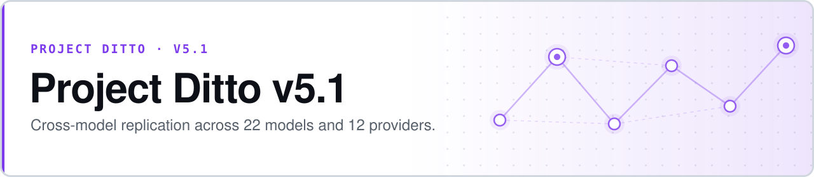

<p align="center">
  <picture>
    <source media="(prefers-color-scheme: dark)" srcset="assets/banner-dark.svg">
    
  </picture>
</p>

# Project Ditto v5.1 — Cross-Model Replication

**v5 found a clean 4-tier hierarchy in one model. Across 22 models, it does not survive.**

v5.1 replays [v5](https://github.com/safiqsindha/Ditto-V5)'s frozen prompt corpus across **22 models from 12 providers** via OpenRouter, extended along two axes that skeptical review identified as load-bearing for the mechanism claim: derived-state **marker ablation** and **strict grounding**. It is the point in the programme where a single-model result meets a panel — and the panel does not agree with it.

- **A real replication attempt, not a victory lap** — the design was pre-registered on OSF *before* any model was hit at full-run scale
- **The null is the finding** — median panel accuracy sits at chance, and the failure mode is specific and reproducible
- **Provider-stratified disclosure** — inference-regime heterogeneity is reported, not averaged away
- **Every response is committed** — 81,460 evaluations, consolidated and re-analysable without touching an API


**[OSF pre-registration](OSF_PREREG.md)** · **[Design spec](v5_1_design/SPEC.md)** · **[Build plan](v5_1_design/BUILD_PLAN.md)** · **[Pre-mortem](v5_1_design/PRE_MORTEM.md)** · **[Red-team appendix](v5_1_design/red_team_appendix.md)** · **[Decision log](DECISION_LOG.md)**

> **Orientation.** This repository was branched from v5 and still carries v5's documents (`STATUS.md`, `MEMO.md`, `SPEC.md`) as inherited context. **The v5.1 work is in [`v5_1_design/`](v5_1_design/), [`OSF_PREREG.md`](OSF_PREREG.md), and [`RESULTS/v5_1/`](RESULTS/v5_1/).** Where the two disagree, v5.1's documents govern.

## The panel

| | |
|---|---|
| Models evaluated | **22**, across 12 providers |
| Total evaluations | **81,460** |
| Total spend | **$59.34** |
| Cells | `pubg` · `nba` · `csgo` · `rocket_league` · `poker` |
| Conditions | 8 — baseline/intervention × marker/no-marker × strict/non-strict |
| Models clearing the §7.3 parse gate | 21 of 22 |

### Panel-level result

| Metric | Median | Range |
|---|---:|---|
| Sensitivity | 0.891 | 0.495 – 1.000 |
| **Specificity** | **0.232** | 0.000 – 0.666 |
| **Accuracy** | **0.508** | 0.424 – 0.618 |

Median accuracy is **0.508** — chance. The pattern behind it is consistent and is not random error: models answer *"violation"* almost regardless of the chain. Sensitivity is high because saying yes to everything catches every true positive; specificity collapses for exactly the same reason. Five of the 22 models score below 0.10 specificity, three of them effectively zero (≤ 0.007), and nine fall below 0.50 accuracy outright.

This is a **response-bias failure, not a detection failure.** The panel is not weakly detecting the signal v5 reported; on this corpus most of it is not discriminating at all.

### Selected models

| Model | Sensitivity | Specificity | Accuracy |
|---|---:|---:|---:|
| `z-ai/glm-5` | 0.569 | **0.666** | **0.618** |
| `x-ai/grok-4-fast` | 0.964 | 0.270 | 0.617 |
| `xiaomi/mimo-v2.5-pro` | 0.882 | 0.249 | 0.565 |
| `kimi-k2.6` | 0.946 | 0.166 | 0.555 |
| `gemini-3-flash-preview` | 0.521 | 0.481 | 0.501 |
| `claude-sonnet-4-6` | 0.703 | 0.339 | 0.520 |
| `claude-haiku-4-5` | 0.941 | 0.006 | 0.473 |
| `deepseek-v4-flash` | 0.928 | 0.054 | 0.491 |
| `meta-llama/llama-3.3-70b` | 0.995 | 0.043 | 0.519 |
| `gpt-5` | 0.634 | 0.215 | 0.424 |

Full per-model, per-cell and per-condition tables: [`RESULTS/v5_1/phase3_consolidated/`](RESULTS/v5_1/phase3_consolidated/).

> **`claude-sonnet-4-5` is excluded from primary analysis.** Its parse rate of 0.8196 falls below the pre-registered §7.3 gate; 882 of 4,000 baseline rows were abstentions. It stays in the committed data for completeness.

## What the pre-registration changed, and why

[`OSF_PREREG.md`](OSF_PREREG.md) does **not** simply operationalise [`v5_1_design/SPEC.md`](v5_1_design/SPEC.md). Smoke-test iteration (2026-04-30 → 05-01) surfaced constraints that forced substantive design changes, and §0 of the pre-registration enumerates them so reviewers can compare both documents side by side.

The largest change is the headline test itself:

| | SPEC.md | OSF pre-registration |
|---|---|---|
| Headline test | Conjunctive within-provider hierarchy — replicates if ≥ 5 of 6 capability ladders show the 4-tier pattern | Mixed-effects logistic regression of the condition main effect, with model-stratified heterogeneity tests |
| Statistical model | Per-cell McNemar with cluster-robust SEs | Multi-level GLM with crossed random effects on `model` and `chain_id` |
| Thresholds | Strict 6/6, moderate 5/6, weak 3–4/6 ladders | Pre-registered minimum detectable effect for H1; H2/H3 require interaction terms above a specified Cohen's *d* |

**Why:** the ladder framing needed ≥ 3 models per provider on a credible capability gradient. After exclusions the panel leaves only Anthropic (3), Google (4), and OpenAI (3) — a conjunctive six-ladder test is no longer testable. The spirit is retained (cross-model heterogeneity matters) but operationalised through mixed effects rather than ladder voting.

Disclosing this in §0 rather than silently substituting the new test is the point.

## Reproducing

```bash
pip install -r requirements.txt
cp .env.example .env          # OpenRouter + provider keys

python -m pytest tests/
```

The consolidated Phase 3 outputs are committed, so the panel tables recompute with no API access:

```
RESULTS/v5_1/phase3_consolidated/
  consolidated.jsonl            all parsed rows
  manifest.json                 per-model provenance → source run + row count
  per_model_summary.csv         sensitivity / specificity / accuracy / cost per model
  per_cell_summary.csv          the same, split by domain cell
  per_condition_summary.csv     the same, split by the 8 experimental conditions
RESULTS/v5_1/smoke_20260501_180858/    smoke run: per-model ledgers + raw results
RESULTS/v5_1/reasoning_control_*.json  reasoning-mode control runs
```

## What this invalidates

A panel-wide null at this scale constrains how earlier versions can be read. Claims resting on a single model's behaviour — v5's 4-tier hierarchy above all — cannot be stated as properties of "language models" without this replication attached. The follow-up work splits into two lines:

- [**v5.2 — Diagnostic Kit**](https://github.com/safiqsindha/Ditto-5.2-diagostic): a pre-registered analysis suite diagnosing the mechanism behind the anti-detection phenomenon seen here.
- [**v5.4 — OLAT**](https://github.com/safiqsindha/DITTO-V5.4-OLAT): if the inference regime rather than the model is the dominant lever, sweeping levers one at a time should show it. It does.

## The Ditto program

| Version | Domain | Headline |
|---|---|---|
| [v1](https://github.com/safiqsindha/Project-Ditto) | Pokémon Showdown telemetry | Sonnet +0.206 · Haiku +0.066 |
| [v2](https://github.com/safiqsindha/Project-Ditto-v2) | Programming agent trajectories | Partial reproduction |
| [v3](https://github.com/safiqsindha/Project-Ditto-V3) | Chess · Chess960 · checkers · draughts | Phase 1 complete, paused at Gate 8 |
| [v4](https://github.com/safiqsindha/Project-Ditto-V4) | Pokémon, as a methodology control | +0.131, strong-positive |
| [v4.5](https://github.com/safiqsindha/Ditto-V4.5--DeepSeek-Flash-test) | DeepSeek V4 Flash cross-model probe | Scoping stub |
| [v5](https://github.com/safiqsindha/Ditto-V5) | PUBG · NBA · CS:GO · Rocket League · poker | 4-tier hierarchy, closed |
| **v5.1** ⟵ *you are here* | **22-model cross-provider panel** | **Near-chance across the panel** |
| [v5.2](https://github.com/safiqsindha/Ditto-5.2-diagostic) | Diagnostic kit for the v5.1 null | Pre-registered, in progress |
| [v5.4](https://github.com/safiqsindha/DITTO-V5.4-OLAT) | 24 inference levers, two DeepSeek models | 6 meaningful conditions |

## Authors

**Safiq Sindha** · **Myriam Khalil** — full CRediT roles in [`OSF_PREREG.md`](OSF_PREREG.md) §12.

## License

[MIT](LICENSE) — free to use, modify, and distribute.
